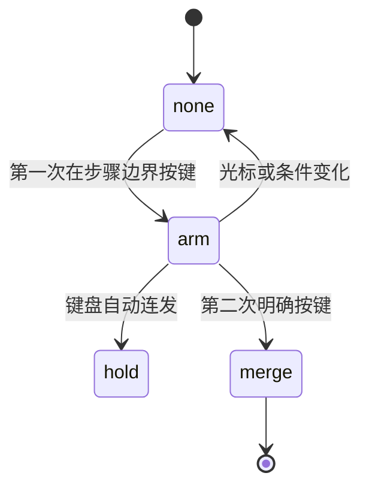
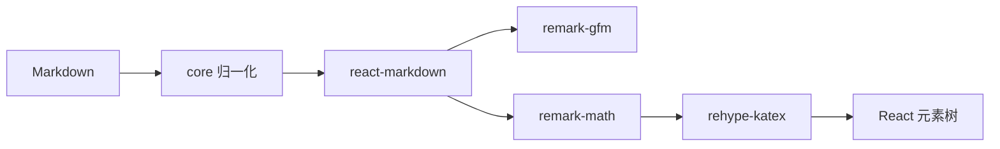

# EquaKit 技术实现与技术选型说明

> 面向希望理解、集成或贡献 EquaKit 的开发者。<br>
> 本文只描述当前代码已经实现的能力；路线图功能会明确标注为“尚未实现”。

## 1. 项目解决的问题

EquaKit 处理数学内容在以下链路中的可靠性：

```text
OCR / LLM / 历史 LaTeX
        ↓
归一化与校验
        ↓
Markdown + KaTeX 渲染
        ↓
复制或框选渲染内容
        ↓
恢复可编辑 Markdown + LaTeX
        ↓
公式输入、分步答案、选择题作答
        ↓
防止旧异步结果覆盖新状态
```

EquaKit 不是完整的 WYSIWYG 文档编辑器，也不负责 OCR、协同编辑、后端存储、用户认证、远程判题或符号计算。

## 2. 总体架构

```text
equakit
├── packages/core
│   ├── math.ts
│   ├── clipboard.ts
│   ├── answerSteps.ts
│   ├── choiceGrading.ts
│   └── mutationGuard.ts
├── packages/react
│   ├── MathFormula.tsx
│   ├── MarkdownMath.tsx
│   ├── FormulaInput.tsx
│   ├── InteractiveChoices.tsx
│   ├── AnswerStepsEditor.tsx
│   └── clipboard.tsx
├── examples/basic
├── scripts/verify-packages.mjs
└── .github/workflows/ci.yml
```

依赖方向保持单向：

```mermaid
flowchart LR
    Demo[Demo] --> React[@equakit/react]
    Demo --> Core[@equakit/core]
    React --> Core
    React --> KaTeX
    React --> Markdown[react-markdown]
    Markdown --> RemarkMath[remark-math]
    Markdown --> RehypeKatex[rehype-katex]
    Core --> KaTeX
```

### 边界原则

- `core` 不依赖 React、API、数据库或用户模型；
- `react` 只提供受控组件，不主动发请求；
- `demo` 只使用公开导出；
- 测试环境可映射源码，但生产构建必须使用真实 package exports；
- 高级编辑器和 AST 能力通过 adapter 扩展，不进入默认运行时。

## 3. Core：数学归一化与校验

实现文件：[`packages/core/src/math.ts`](../packages/core/src/math.ts)

### 3.1 分隔符剥离

`stripMathDelimiters()` 循环移除以下外层分隔符：

- `$...$`
- `$$...$$`
- `\(...\)`
- `\[...\]`

使用循环是为了支持被多层分隔符包裹的输入，同时保持表达式内部内容不变。

### 3.2 独立 LaTeX 归一化

`normalizeLatexExpression()`：

1. 移除外层分隔符；
2. 修正常见的分数指数结构；
3. 为极限类运算符补充 `\limits`；
4. 保持重复执行幂等。

### 3.3 Markdown 数学归一化

`normalizeMarkdownMath()`：

- 将 `\(...\)` 统一为 `$...$`；
- 将 `\[...\]` 统一为 `$$...$$`；
- 让展示公式分隔符独占行；
- 修复裸 LaTeX 公式行；
- 折叠过量空行；
- 避免把普通中文或英文句子整体包成公式。

`isFormulaShapedLatexLine()` 采用保守启发式：既检查 LaTeX command，也检查自然语言词组和公式结构。它不是完整 parser，因此无法理解复杂 macro redefine。

### 3.4 token 提取

`extractMathTokens()` 返回：

```ts
interface MathToken {
  expression: string;
  display: boolean;
  start: number;
  end: number;
  delimiter: '$' | '$$';
}
```

调用方可以据此标记错误位置、生成编辑器装饰或接入更完整的 AST parser。

### 3.5 KaTeX 校验

`validateLatexExpression()` 和 `validateMarkdownMath()` 使用 `katex.renderToString()` 校验表达式，返回结构化结果而不是把异常抛给 UI：

```ts
interface MathValidationResult {
  ok: boolean;
  normalized: string;
  issues: MathValidationIssue[];
}
```

这样用户在输入尚未完成的公式时仍能继续编辑。

## 4. Core：数学富文本复制恢复

实现文件：[`packages/core/src/clipboard.ts`](../packages/core/src/clipboard.ts)

### 4.1 三种入口

- `richHtmlToMarkdown()`：处理剪贴板 HTML；
- `richDomToMarkdown()`：处理现有 DOM root；
- `richSelectionToMarkdown()`：处理 live Range 和原始 DOM。

DOM 不可用或解析失败时，回退到规范化后的纯文本。

### 4.2 DOM 序列化规则

遍历器会：

- 保留文本节点；
- 把 `strong/b` 转成 `**...**`；
- 把 `em/i` 转成 `*...*`；
- 为块级节点添加换行；
- 为列表项添加 Markdown 前缀；
- 跳过 `script`、`style` 和显式排除节点；
- 将公式节点恢复成 `\(...\)`。

### 4.3 公式源码恢复顺序

1. 当前元素的 `data-math-source`；
2. 后代元素的 `data-math-source`；
3. MathML `annotation[encoding="application/x-tex"]`；
4. plain text fallback。

属性名和排除 selector 支持配置。非法配置会回退到默认安全规则，避免 selector 异常绕过排除逻辑。

### 4.4 为什么使用 live Range

复制 clone 可能只包含 KaTeX 视觉节点的一部分，丢失外层源码标记。`richSelectionToMarkdown()` 使用原始 DOM 和 `Range.intersectsNode()`，即使选区终点位于公式内部，也能向上恢复规范源码。

## 5. Core：分步答案

实现文件：[`packages/core/src/answerSteps.ts`](../packages/core/src/answerSteps.ts)

### 5.1 文本转换

- `stepTextToLines()`：移除数字、字母和 Markdown bullet 前缀；
- `formatStepAnswer()`：清理空步骤并重新编号；
- `splitStepAtCursor()`：按光标拆分步骤；
- `mergeStepWithPrevious()`：与前一步合并；
- `mergeStepWithNext()`：与后一步合并。

### 5.2 边界删除状态机



第一次按 Backspace/Delete 只进入待确认状态，第二次才合并，减少误删除步骤结构。

## 6. Core：选择题判分

实现文件：[`packages/core/src/choiceGrading.ts`](../packages/core/src/choiceGrading.ts)

支持：

- A-H；
- 单选和多选；
- 大小写和 NFKC 归一；
- 括号、逗号、顿号和空格；
- `$D$`、`答案：A、C`、`\mathrm{A C}` 等展示形式；
- 多选顺序无关。

含“不是”“不选”“except”“not”等否定语义时返回 `null`，避免猜测答案。

判分结果包括：

```ts
interface ChoiceGradeResult {
  correct: boolean;
  expected: ChoiceLetter[];
  selected: ChoiceLetter[];
  missing: ChoiceLetter[];
  extra: ChoiceLetter[];
  multi: boolean;
}
```

## 7. Core：异步过期保护

实现文件：[`packages/core/src/mutationGuard.ts`](../packages/core/src/mutationGuard.ts)

`KeyedMutationVersion` 为每个资源维护独立版本号。新请求开始时递增版本，响应返回时只有版本仍然相同才能被采用。

`clear()` 不删除版本，而是使用 tombstone 递增，防止旧版本在清理后重新变得有效。

`StaleResponseGuard<TScope>` 进一步保存 scope：

```ts
guard.setScope('question-1');
const snapshot = guard.begin('grade');
```

用户切换资源后，即使 key 或 version 意外相同，scope 也会拒绝旧响应。

## 8. React：公式渲染

实现文件：[`packages/react/src/MathFormula.tsx`](../packages/react/src/MathFormula.tsx)

执行过程：

1. 调用 core 剥离分隔符；
2. 使用 `useMemo()` 缓存 KaTeX HTML；
3. 设置 `throwOnError: true`、`strict: 'ignore'`、`trust: false`；
4. 失败时显示源码或自定义 fallback；
5. 成功时输出 `data-math-source`，供复制恢复。

组件使用 `dangerouslySetInnerHTML`，但 HTML 仅来自 `trust: false` 的 KaTeX 输出，不直接使用用户 HTML。

## 9. React：Markdown 数学管线

实现文件：[`packages/react/src/MarkdownMath.tsx`](../packages/react/src/MarkdownMath.tsx)



安全默认值：

- 不启用 `rehype-raw`；
- 原始 HTML 作为文本显示；
- URL 使用协议 allowlist；
- 拒绝 `javascript:`；
- protocol-relative URL 也必须经过协议校验。

## 10. React：公式输入

实现文件：[`packages/react/src/FormulaInput.tsx`](../packages/react/src/FormulaInput.tsx)

`FormulaInput` 是轻量 textarea + palette，而不是完整的结构化 math field。

它支持：

- 自定义公式 palette；
- 光标位置插入模板；
- LaTeX/Markdown 两种校验模式；
- 实时 KaTeX 预览；
- 中文 label、placeholder 和错误提示；
- 受控 `value/onChange`。

校验结果通过 `useMemo()` 缓存，避免重复触发 `onValidationChange`。

## 11. React：选择题和分步答案

### `InteractiveChoices`

- 单选使用原生 radio；
- 多选使用原生 checkbox；
- 内容通过 `MarkdownMath` 渲染；
- 根据 `correct/reveal` 显示正确、错误和选中状态；
- 组件不负责调用 core 判分，宿主应用可自由组合。

### `AnswerStepsEditor`

- 每一步使用受控 textarea；
- 支持添加和删除；
- 调用 core 状态机处理边界删除；
- 第一次边界按键只进入待确认，第二次才合并。

## 12. React：复制边界

实现文件：[`packages/react/src/clipboard.tsx`](../packages/react/src/clipboard.tsx)

`MathCopyBoundary` 在 `onCopy` 中：

1. 获取 Selection；
2. clone 当前 Range；
3. 调用 core serializer；
4. 阻止浏览器默认复制；
5. 写入规范化 `text/plain`。

当前只写 `text/plain`。未来可增加：

- `text/markdown`；
- `application/x-latex`；
- `application/mathml+xml`；
- MathJSON。

## 13. 构建和 CI

### pnpm workspace

选择 pnpm 的原因：

- workspace 依赖清晰；
- 严格依赖结构能发现幽灵依赖；
- `pnpm -r` 按拓扑执行；
- `workspace:^` 在 pack 时转换为 semver；
- 内容寻址存储减少重复依赖。

### TypeScript

根配置使用 ES2022、ESM、Bundler resolution 和严格模式。

React 构建与 typecheck 使用不同配置：

- build 消费真实 package exports；
- typecheck 在无 `dist` 的干净检出中映射到 core 源码；
- Vitest 使用测试专用 alias；
- 正式 package build 不使用测试 alias。

### 验证链路

```text
format:check
→ lint
→ typecheck
→ 42 个测试
→ core/react/demo build
→ 真实 pnpm pack
→ tarball 文件白名单
→ ESM 动态导入
```

GitHub Actions 在 pull request 和 `main` push 时执行完整 `pnpm check`。

## 14. 为什么使用 TypeScript

### 相比纯 JavaScript

TypeScript 提供：

- 公共 API declaration；
- 泛型 scope；
- discriminated union；
- 严格 optional property；
- 重构保护；
- DOM/Selection/Range 类型。

### 相比 Rust/WASM

当前工作主要是 DOM、字符串和 React 状态，不是 CPU 密集计算。Rust/WASM 会增加构建、调试、跨边界序列化和包体成本，但 DOM 仍需 JavaScript 适配。

如果未来引入完整 TeX parser 或大规模批处理，可将 Rust/WASM 作为可选 adapter，而不是默认实现。

## 15. 为什么默认使用 KaTeX

KaTeX 的优势：

- 同步 `renderToString()`；
- SSR 友好；
- 输出确定；
- `trust: false` 安全边界清晰；
- 与 remark/rehype 集成成熟；
- 默认包含 HTML + MathML。

### 相比 MathJax

MathJax 的 TeX/MathML 覆盖更广，但运行时和配置更重。当前轻量预览和 SSR 不需要完整能力，因此更适合作为未来 renderer adapter。

### 相比 MathLive

MathLive 的结构化输入、虚拟键盘、多格式和无障碍能力更强，但它更像完整输入引擎。EquaKit 保留 KaTeX 作为轻量默认层，未来为 `FormulaInput` 增加按需加载的 MathLive adapter。

相关项目：

- <https://github.com/KaTeX/KaTeX>
- <https://github.com/mathjax/MathJax>
- <https://github.com/arnog/mathlive>

## 16. 为什么不直接使用 MathQuill

MathQuill 是成熟的所见即所得公式输入方案，但：

- 架构历史较长；
- 现代 TypeScript/Web Component 边界不如 MathLive 清晰；
- MPL-2.0 许可证需要额外评估；
- 不能替代 EquaKit 的 clipboard round-trip、答案步骤和 mutation guard。

当前 textarea 不是比 MathQuill 更强，而是默认成本更低。完整输入体验应通过 adapter 提供。

项目：<https://github.com/mathquill/mathquill>

## 17. 为什么使用 React 作为可选 UI 层

React 的受控 `value/onChange` 模式适合输入组件，并且与 `react-markdown`、SSR 和现有生态兼容。

关键是 core 不依赖 React，因此 Vue、Svelte、Web Components 或 plain DOM 仍可直接复用核心能力。未来可以增加其他框架包，无需重写 core。

## 18. 为什么使用 remark 生态

当前组合：

```text
react-markdown + remark-gfm + remark-math + rehype-katex
```

相比直接生成 HTML 字符串，它能：

- 将 Markdown AST 和 HTML AST 分层；
- 直接产生 React 组件树；
- 默认关闭 raw HTML；
- 复用成熟数学插件；
- 支持 SSR。

`markdown-it` 速度和插件生态也很强，但需要额外 React 和安全桥接。MDX 支持在 Markdown 内执行组件，不适合默认处理不可信输入。

## 19. 为什么使用保守规则而不是默认 AST parser

当前 regex/启发式适合常见分隔符修复和轻量归一化，代码和运行时成本低。

限制是无法理解复杂 macro 和完整 TeX 语义。`unified-latex` 更适合结构化转换和 round-trip，因此计划作为可选 adapter，不进入默认 runtime。

项目：<https://github.com/siefkenj/unified-latex>

## 20. 为什么使用 Vitest 和 Vite

Vitest 与 Vite/ESM/TypeScript 共享转换模型，配置比 Jest + Babel 更少。Vite 只负责 Demo 构建，库本身用 `tsc` 输出多模块 ESM。

如果未来需要 CJS、多入口 bundle 或 minify，可评估 tsup/Rollup。当前 ESM-only 与 Node.js 22+ 的目标一致。

## 21. 安全设计

已经实现：

- Markdown raw HTML 默认关闭；
- URL protocol allowlist；
- KaTeX `trust: false`；
- DOM 只读序列化；
- selector/属性名失败安全回退；
- tarball 文件白名单；
- ESM import smoke；
- GitHub Secret Scanning；
- Push Protection；
- 依赖 audit。

未发现 API key、token、password、private key、生产域名/IP、bucket、数据库连接串或构建绝对路径。

## 22. 已知局限

### 功能

- 不是完整数学 WYSIWYG；
- 没有虚拟键盘；
- 只输出单一 clipboard MIME；
- 没有 AST round-trip；
- 没有 MathJSON；
- 不支持协同编辑；
- 选择题限定 A-H。

### 测试

- 真实浏览器 Selection/Range/ClipboardEvent 测试尚未添加；
- IME/composition 尚未测试；
- 屏幕阅读器矩阵尚未测试；
- React 测试以 SSR 和纯函数为主。

### 无障碍

- `InteractiveChoices` 需要补 legend；
- 结果和边界待确认状态需要 aria-live；
- MathFormula 的 aria-label 与 KaTeX MathML 组合需要真实屏幕阅读器验证。

### 工程

- Demo 同时打包所有能力，chunk 偏大；
- 尚未提供自动 API 文档；
- 尚未提供浏览器兼容矩阵和 bundle budget；
- npm package 仍保持 private。

## 23. 演进路线

### P0：开源治理

- 确认贡献者署名；
- 完成 npm scope 和元数据；
- 更新公开安全联系渠道；
- 启用 Dependabot 和 CodeQL。

### P1：真实浏览器和无障碍

- Playwright 测试；
- Selection/Range/ClipboardEvent；
- 光标和 IME；
- fieldset legend；
- aria-live；
- VoiceOver/NVDA 测试。

### P2：可选 adapter

```text
@equakit/adapter-mathlive
@equakit/adapter-tiptap
@equakit/adapter-unified-latex
@equakit/adapter-mathjax
```

### P3：多格式

- LaTeX；
- Markdown preset；
- MathML；
- AsciiMath；
- MathJSON；
- 多 MIME clipboard。

### P4：开发者体验

- TypeDoc；
- 在线 playground；
- CHANGELOG；
- Changesets/semantic-release；
- bundle size CI；
- subpath exports。

## 24. 技术决策总结

| 领域     | 当前选择           | 原因                 | 未来增强                 |
| -------- | ------------------ | -------------------- | ------------------------ |
| 语言     | TypeScript         | 浏览器/npm/类型共享  | Rust/WASM parser adapter |
| 渲染     | KaTeX              | 轻量、同步、SSR      | MathJax adapter          |
| 输入     | textarea + palette | 默认成本低           | MathLive adapter         |
| UI       | React 可选层       | 受控组件和生态       | Vue/Web Components       |
| Markdown | remark/rehype      | AST 分层和安全默认   | 可配置 preset            |
| 解析     | 保守启发式         | 轻量和可预测         | unified-latex adapter    |
| 包管理   | pnpm               | workspace 和严格依赖 | 暂无迁移动机             |
| 测试     | Vitest             | ESM/Vite 集成        | Playwright 浏览器层      |
| 构建     | tsc + Vite Demo    | 保留模块边界         | tsup/Rollup 按需引入     |

## 25. 结论

EquaKit 当前的技术路线不是为了比 MathLive、MathJax、TipTap 或 unified-latex 更完整，而是为了提供轻量、可组合、安全默认的数学内容基础能力。

应继续自研的差异化部分是：

- clipboard round-trip；
- answerSteps 状态机；
- choice grading；
- mutation guard；
- 保守数学归一化。

成熟生态已经做得更好的能力应作为 adapter 接入：

- MathLive 的结构化输入和虚拟键盘；
- MathJax 的广泛数学兼容；
- TipTap 的富文本 math node；
- unified-latex 的 AST；
- Compute Engine 的 MathJSON 和符号计算。

这种边界能让默认包保持轻量，也能在需要时获得更强能力，而不迫使所有使用者承担完整编辑器的依赖和复杂度。
